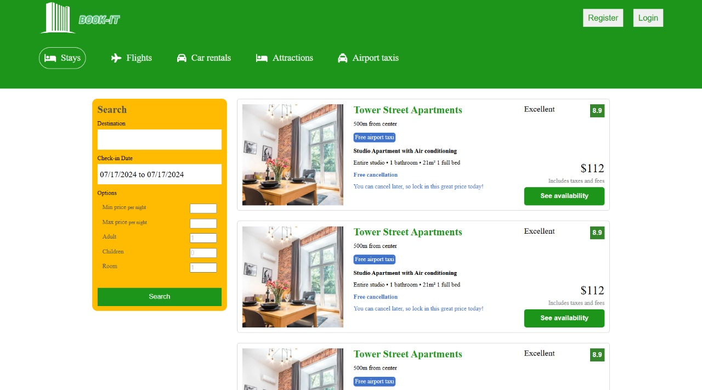

# Hotel Booking Application

A comprehensive hotel booking application built with React and React Router, providing users with the ability to browse, search, and book hotels seamlessly.

## Deployment

The application is deployed and can be accessed at [Book-IT](https://hotel-site-mrr6.onrender.com/).

## Screenshots

1. **Home Page**
   

2. **List Page**
   

## Features

- Browse featured hotels and properties
- Search hotels based on destination, date range, and other options
- View detailed information about each hotel, including images and descriptions
- Interactive image gallery with navigation
- Consistent navigation and layout across all pages
- Subscription to a mailing list

## Pages and Components

### Home Page (`Home.jsx`)

- **Components Used:**
  - `Navbar`: Navigation bar.
  - `Header`: Header section.
  - `Featured`: Displays featured hotels.
  - `PropertyList`: Shows different types of properties.
  - `FeaturedProperties`: Highlights popular properties.
  - `MailList`: Subscription form for the mailing list.
  - `Footer`: Footer information and links.

### List Page (`List.jsx`)

- **Components Used:**
  - `Navbar`: Navigation bar.
  - `Header`: Header section.
  - `SearchItem`: Displays individual search results.
- **Functionality:**
  - Search and filter hotels based on destination, date range, price, and other options.
  - Displays a list of search results dynamically.


## Installation

1. Clone the repository:

   ```bash
   git clone https://github.com/your-username/hotel-booking-app.git
